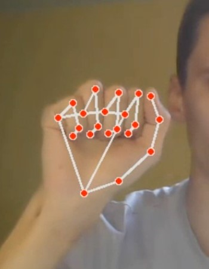

# DLS
Repo for deep learning school

* [Идея](#1)
* [Краткое описание MVP](#2)
* [Работа и запуск приложения](#3)
* [Развитие MVP](#4)

## <a id="1">Идея</a>
Данный проект реализован в качестве заключительного по обучению в DLS. Суть данного проекта заключается в том, чтобы облегчить управление умным домом для немых людей. 
В нынешнее время мы имеем большие возможности в управлении разными устройствами при помощи голоса, но к сожалению, не все могут воспользоваться ими. 
Так только в России люди имеющие проблемы с речевым аппаратом ~ 200000 человек. 
На эту внушительную аудиторию был направлен данный проект, который позволит снять еще одно ограничение нуждающимся в возможностях в наше "цифровое" время.

## <a id="2">Краткое описание MVP</a>
Предполагается, что в 1 помещении (комнате) будут находиться 2 камеры, которые будут отслеживать ключевые движения пользователя.
Полученная информация обрабатывается и отправляется на мини-сервер (например RaspberryPi) и далее по протоколу zigbee отправлять команды на конечные устройства. 
Данный прототип продукта (MVP), представлен в виде web приложения на основе Streamlit библиотеки. В основе него лежит универсальная нейросеть (НС) - mediapipe.
Подобранная НС позволяет с большой точностью детектировать части тела (в частности руки) и переводить ключевые точки объекта в координаты на картинке/кадре.
В ходе реализации было рассмотрено 2 подхода к классификация команд: при помощи алгоритмов ML (RendomForest, KNN) и алгоритмическая работа по точкам.
В связи с этим в репозитории присутствуют 2 версии приложения. **Рабочая версия app_v1**. В app_v2 требуется большоее колличество разноплановых данных, для обучения классификатора,
без этого реализация очень плохая.

## <a id="3">Работа и запуск приложения</a>
Запуск проекта осуществляется по команде: **streamlit run app_v1/application.py**, также можно запустить streamlit как модуль python, добавив **python -m** перед streamlit ...

После запуска открывается web приложение, которое содержит 1 кнопку "Start". При её нажатии начинается работа основного процесса распознавания движения рук.
На данном этапе данное MVP умеет распознавать 11 объектов: 4 системных символа, и 7 объектов имитирующих объекты умного дома. Производить работу следует в следующем порядке:
Жест начала работы -> Выбрать действие (включить/выключить) -> Выбрать объект. Аналог команд в быту: "Алиса, включи музыку"
Распознавание команд производится в течении 7 сек, этого достаточно. Если требуется прервать распознавание команд, то можно показать жест "Сбросить информацию".
Результирующая информация появляется в верхнем левом углу того же экрана.

#### Системные символы
|Начало работы алгоритма| Сбросить информацию |Включить устройство |Выключить устройство|
| ----------- | ----------- |---------- |----------- |
|||||

#### Символы объектов
|Чайник|Телевизор |Мультимедиа|Микроволновка|
| ----------- | ----------- |---------- |----------- |
|||||

|Свет|Шторы |Кондиционер|
| ----------- | ----------- |---------- |
||||

Пример работы можно посмотреть на [видео](https://drive.google.com/file/d/1yhadFEX73UuLX_kdVjgKdY2Fa3N_RJ-P/view?usp=sharing)

## <a id="4">Будущее MVP</a>
Главной проблемой при реализации данного проекта было время и данные. 
Для дальнейшего развития проекта потребуется:
1. обучить классификатор для большего колличества объектов;
2. добавить возможность производить настройку объектов (ex: изменить громкость музыки или настроить время микроволновки)
3. написать код по адресной отправке команд на устройства.
4. разместить проект на RaspberryPi
